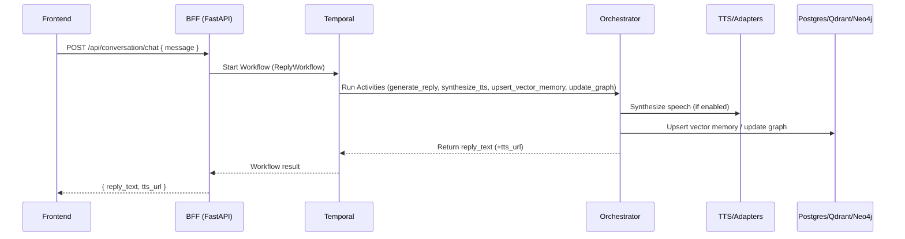

# Dataflow & Architecture

This document shows the high-level component topology and request flows.

## Topology

```mermaid
flowchart LR
  subgraph Client
    UI[Frontend (Vite/React)]
  end

  subgraph App
    BFF[FastAPI BFF :5000]
    ORC[Orchestrator Worker]
  end

  subgraph Infra
    PG[(Postgres 16)]
    TDB[(Qdrant)]
    GDB[(Neo4j 5)]
    TMP[Temporal Server]
    STT[STT (Whisper)]
    T11[11Labs Adapter]
    TTS[(Local TTS)]
    OLL[Ollama]
    LMS[LM Studio]
  end

  UI -- /api/*, /hubs/* --> BFF
  BFF -- Temporal SDK --> TMP
  TMP <--> ORC
  BFF <-- SQLAlchemy --> PG
  BFF <---> TDB
  ORC <---> TDB
  ORC <---> GDB
  ORC --> T11
  ORC --> TTS
  ORC --> STT
  ORC --> OLL
  ORC --> LMS
```

## Chat Request Flow



## Health & Readiness

- BFF: `/healthz`, `/api/readyz`
- Temporal: server on `localhost:7233`
- Qdrant: `http://localhost:6333`
- Neo4j: HTTP `localhost:7474` / Bolt `localhost:7687`
- STT: `http://localhost:9000`
- 11Labs adapter: `http://localhost:8082`

