# Dataflow & Architecture Overview

## Overview
This document consolidates the primary SwAIvyn data flows, diagrams, and persistence strategies. It combines the original architecture diagrams with the updated narrative describing how data moves through the system so that developers have a single source of truth.

## Core Data Entities
1. **Users** – Authentication, preferences, and ownership context for all resources.
2. **Folders** – Hierarchical organization of conversations with optional parent-child relationships.
3. **Conversations** – Chat sessions that contain metadata and link to chat index entries.
4. **Chat Index** – Lightweight references to message files with role and timestamp metadata for efficient lookup.
5. **Memories** – User-specific knowledge used for personalization and long-term recall.
6. **Vector Embeddings** – Semantic representations of text stored in SQLite-VSS for similarity search.
7. **Graph Relationships** – Memory relationships stored in Neo4j for graph queries and visualization.
8. **Settings** – Application and user preferences that control runtime behaviour.

## Data Persistence Strategy
1. **SQLite (WAL mode)** – Primary relational store for structured data such as users, folders, conversations, indices, and settings.
2. **SQLite-VSS Extension** – Embedding storage that enables HNSW-powered semantic search inside the main SQLite database.
3. **Neo4j Graph Database** – Persists memory nodes and relationships (embedded or remote deployment).
4. **File System** – Stores chat message JSON payloads and binary assets referenced by the database.
5. **In-Memory Cache** – Caches frequently accessed data to reduce I/O and improve responsiveness.

## Database Interactions
### Reading Data
```csharp
var folders = await _dbContext.Folders
    .Where(f => f.UserId == userId)
    .OrderBy(f => f.Name)
    .ToListAsync();

var conversations = await _dbContext.Conversations
    .Where(c => c.UserId == userId)
    .OrderByDescending(c => c.LastOpenUtc)
    .ToListAsync();

var conversation = await _dbContext.Conversations
    .Where(c => c.UserId == userId)
    .OrderByDescending(c => c.LastOpenUtc)
    .FirstOrDefaultAsync();

// Generate embedding for the query
var queryEmbedding = await _embeddingService.EmbedTextAsync(query);

// Search the vector store
var hits = await _vectorStore.SearchAsync(queryEmbedding, limit, scope);
```

### Writing Data
```csharp
var folder = new Folder
{
    Id = Guid.NewGuid(),
    UserId = userId,
    Name = name,
    ParentId = parentId,
    CreatedUtc = DateTime.UtcNow
};
_dbContext.Folders.Add(folder);
await _dbContext.SaveChangesAsync();

var conversation = new Conversation
{
    Id = Guid.NewGuid(),
    UserId = userId,
    FolderId = folderId,
    Title = title,
    CreatedUtc = DateTime.UtcNow,
    LastOpenUtc = DateTime.UtcNow
};
_dbContext.Conversations.Add(conversation);
await _dbContext.SaveChangesAsync();

var timestamp = DateTime.UtcNow;
var fileName = $"{timestamp:yyyyMMdd_HHmmss}.json";
var filePath = Path.Combine(conversationDir, fileName);
var message = new { role, content, timestamp = timestamp.ToString("o") };
await File.WriteAllTextAsync(filePath, JsonSerializer.Serialize(message));

var chatIndex = new ChatIndex
{
    Id = Guid.NewGuid(),
    ConversationId = conversationId,
    Role = role,
    FilePath = Path.Combine("sessions", conversationId.ToString(), fileName),
    CreatedUtc = timestamp
};
_dbContext.ChatIndices.Add(chatIndex);
await _dbContext.SaveChangesAsync();

var embedding = await _embeddingService.EmbedTextAsync(text);
var vectorStoreSuccess = await _vectorStore.StoreVectorAsync(id, embedding, metadata);
var node = await _neo4jService.CreateNodeAsync(new List<string> { "Memory" }, new()
{
    { "id", id.ToString() },
    { "text", text }
});
```

## System Topologies
### Hybrid Development Topology
```mermaid
flowchart LR
  subgraph Host
    FE[Frontend (Vite 5173)] -->|REST/WS| BFF[BFF (FastAPI 5000)]
    BFF -->|Temporal Client| TMP[Temporal Frontend (7233)]
    WKR[Orchestrator Worker] -.runs via dev-orchestrator.ps1.- TMP
    BFF -->|JDBC/asyncpg| PG[(Postgres)]
    BFF -->|HTTP| QD[(Qdrant)]
    BFF -->|Bolt| NEO[(Neo4j)]
    FE -->|HTTP| TTS[(Fish Speech TTS 8081)]
  end

  subgraph Docker (infra)
    PG
    QD
    NEO
    STT[Whisper STT 9000]
    TMP
    ADPT[11Labs Adapter 8082]
  end

  WKR -->|HTTP (engine-specific)| LLM1[LM Studio /v1]
  WKR -->|HTTP| OLL[Ollama /api]
  WKR -->|HTTP| OAI[OpenAI /v1]
  WKR -->|HTTP| CLD[Claude /v1]
  WKR -->|HTTP| VLLM[vLLM /v1]

  classDef host fill:#f0fff4,stroke:#16a34a,stroke-width:1px;
  classDef docker fill:#f8fafc,stroke:#334155,stroke-width:1px;
  class Host host;
  class Docker docker;
```

**Notes**
- Apps run on host with hot reload; infrastructure remains in Docker.
- Fish Speech TTS can run on host (`-UseHostTTS`) or inside Docker (profile `tts`).
- Compose profiles keep app-tier images optional: `orchestrator`, `tts`, `tts-adapter`.

### Network Boundaries & Ports
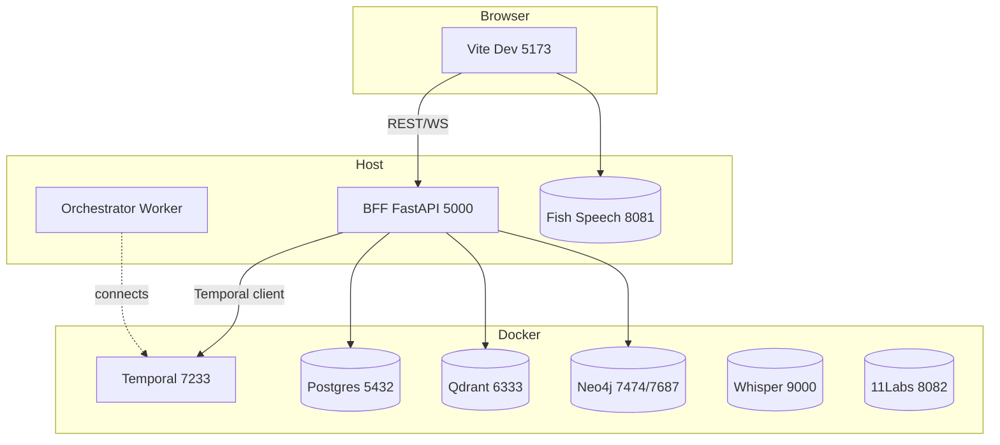

### Environment Keys
- `FISHSPEECH_URL` — `http://localhost:8081` for host TTS or `http://tts:8081` for container TTS.
- `OLLAMA_HOST`, `LMSTUDIO_HOST` — host URLs when the worker runs on the host.
- `OPENAI_API_KEY`, `CLAUDE_API_KEY` — required to enable those engines.

### Profiles & Scripts
- Compose profiles: `orchestrator`, `tts`, `tts-adapter`.
- Scripts:
  - `scripts/infra-up.ps1` — start only infrastructure (with optional profiles).
  - `scripts/dev-start.ps1 -UseHostTTS` — start host apps plus host TTS window.
  - `scripts/dev-tts.ps1` — run Fish Speech on host.
  - `scripts/dev-stop.ps1` — stop host apps (and host TTS).
  - `scripts/update.ps1` — update dependencies and container images.

## Application Flows
### Startup Flow
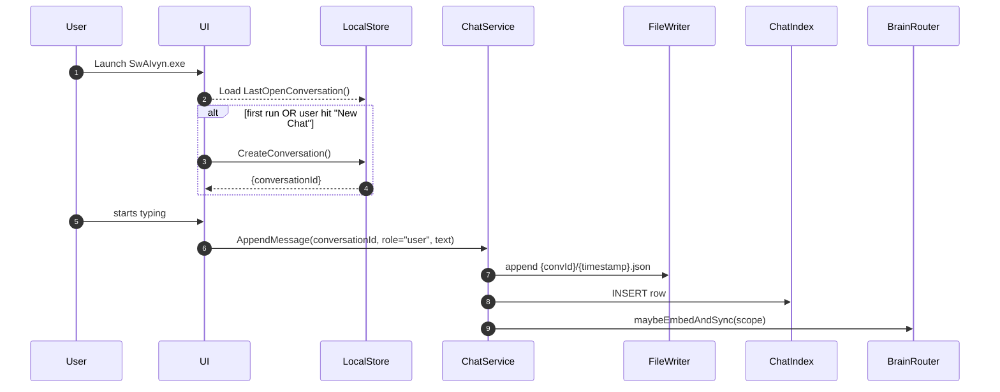

### Folder & Conversation Management Flow
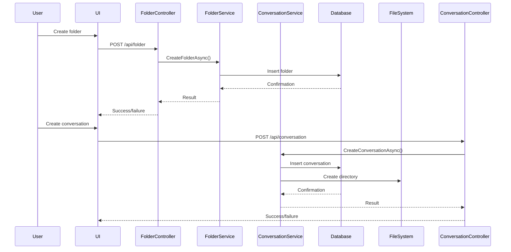

### Chat & Messaging Flows
#### Per-User Chat Message Flow
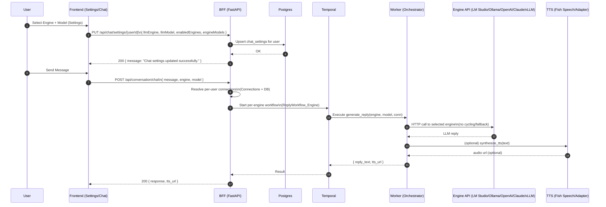

#### Chat Interaction Flow
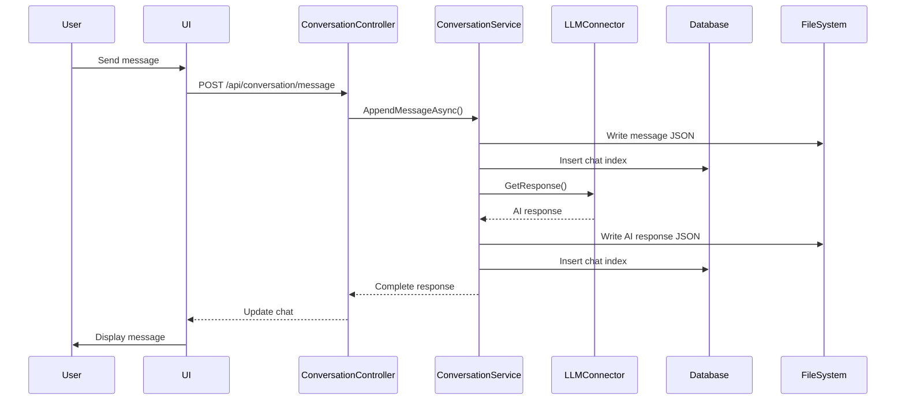

#### LLM Interaction Flow
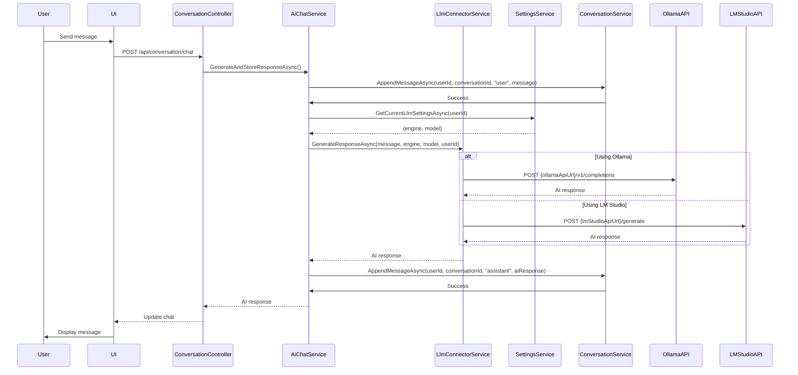

### Settings & Authentication Flows
#### Settings Save & Rehydrate (UI)
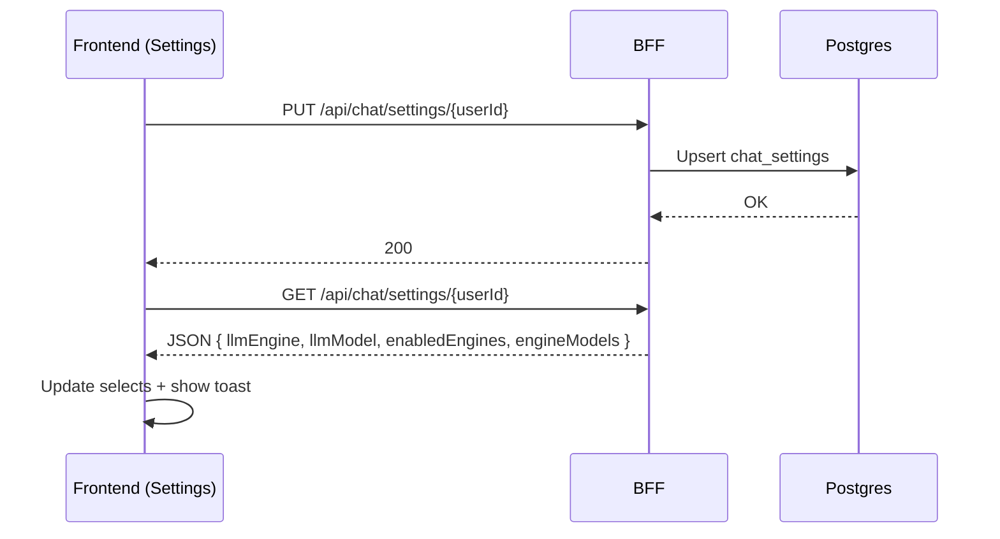

#### Authentication (Login) Flow
```mermaid
sequenceDiagram
  autonumber
  participant U as User
  participant FE as Frontend
  participant B as BFF (FastAPI)
  participant DB as Postgres

  U->>FE: Submit username/password
  FE->>B: POST /api/auth/login {identifier, password}
  B->>DB: SELECT users WHERE username/email
  DB-->>B: Row (id, password_hash, role)
  B-->>FE: 200 {access_token, user}
  FE->>FE: Save token (optional)
  FE->>FE: Set axios Authorization header
  FE->>B: GET /api/auth/me (boot check)
  B-->>FE: Current user (id, role, prefs)
  FE->>FE: Auth gate opens; render app
```

#### Initialization & Auth Gate (UI)
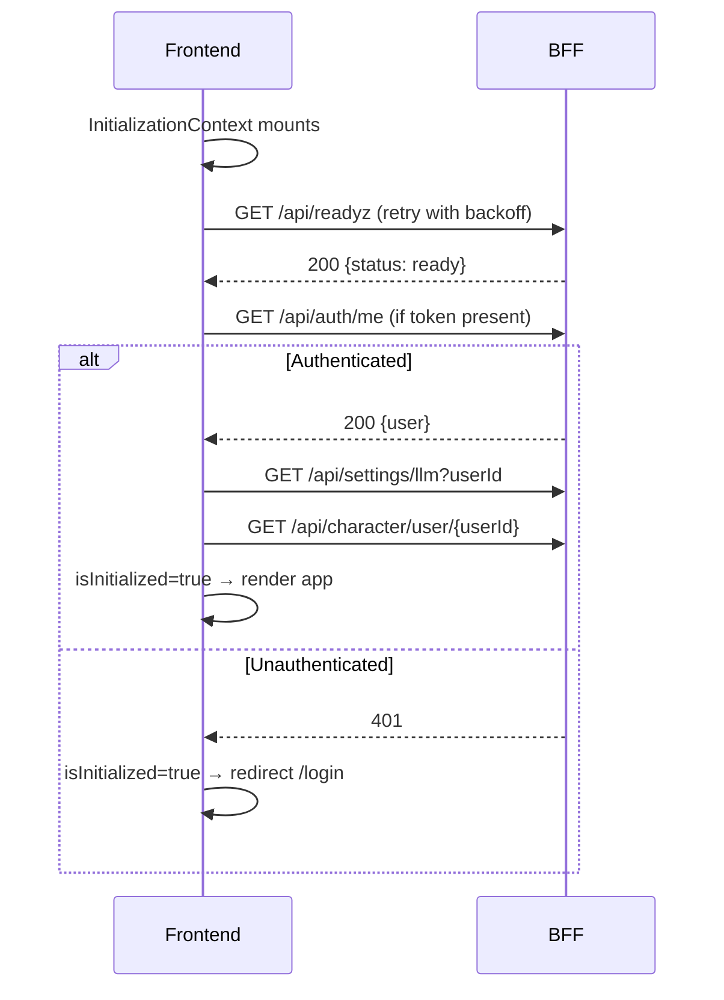

#### Authorization Matrix (Summary)
| Resource/Action                          | User (self) | Admin |
|------------------------------------------|-------------|-------|
| GET/PUT /api/chat/settings/{userId}      | ✓ (self)    | ✓ any |
| GET/POST/PUT /api/settings/connections   | ✓ (self)    | ✓ any |
| GET /api/conversation/user/{userId}      | ✓ (self)    | ✓ any |
| GET/PUT /api/conversation/{id}/(title|folder|messages) | ✓ owner | ✓ any |
| POST /api/conversation/message           | ✓ owner     | ✓ any |
| GET /api/llm/models (userId)            | ✓ (self)    | ✓ override |

### Search & Knowledge Flows
#### Brain Search Flow
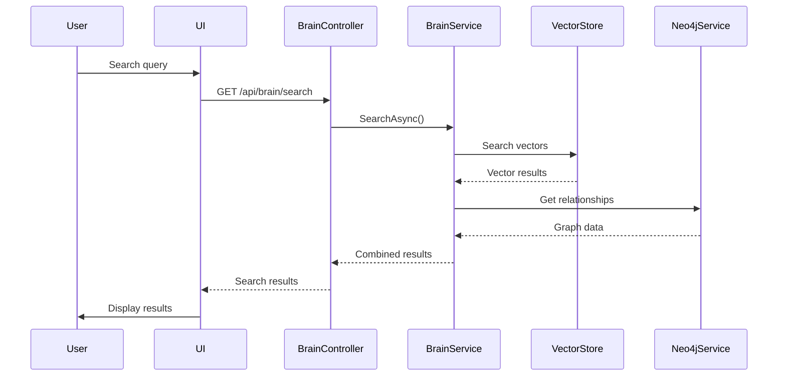

#### Neo4j Interaction Flow
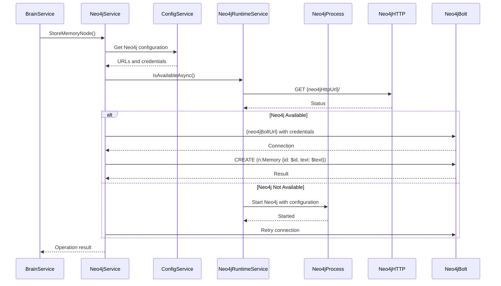

### Voice & Agent Flows
#### TTS Playback Pipeline
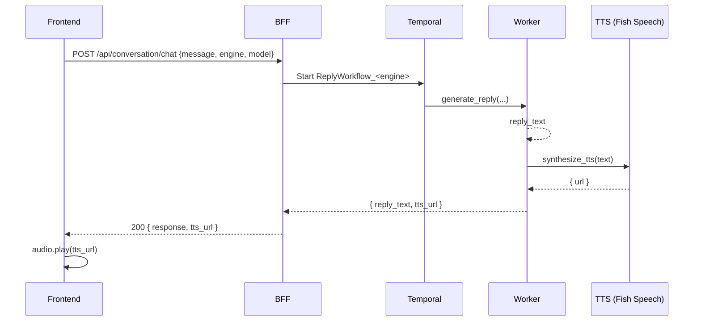

#### STT Ingestion (Voice Room – current + hooks)
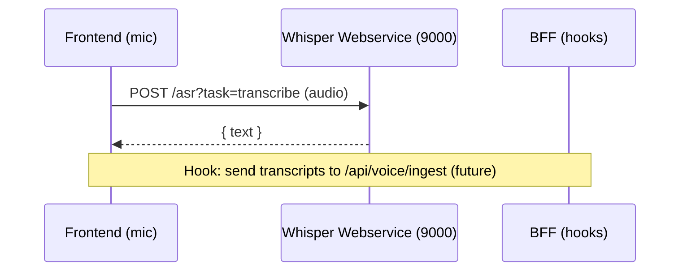

#### Agents / Federation Hooks (Future)
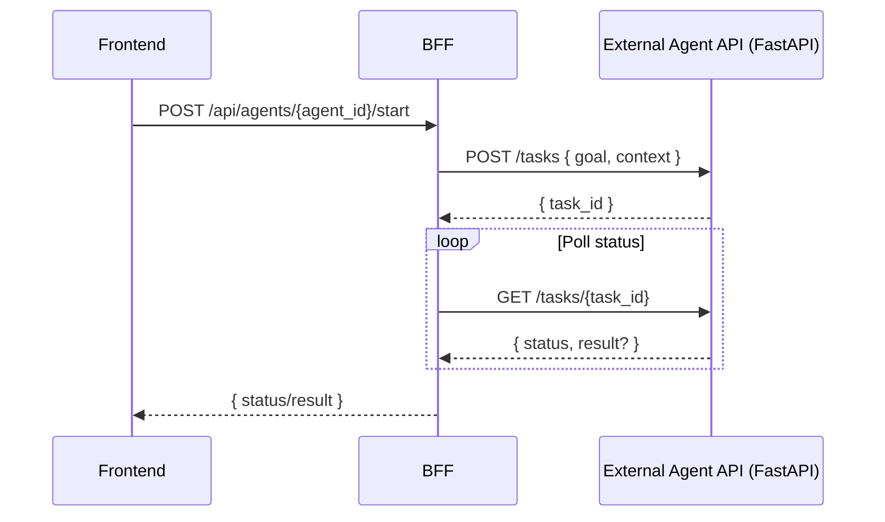

### Additional Architecture Views
#### LLM Routing (Strict, Per-Engine)
```mermaid
flowchart LR
  IN[POST /api/conversation/chat\n{engine, model, message}] --> VALIDATE{engine & model?}
  VALIDATE -- no --> ERR[400 Invalid engine/model]
  VALIDATE -- yes --> WF[Pick ReplyWorkflow_<engine>]
  WF --> ACT[generate_reply(engine, model, conn)]
  ACT --> CALL[HTTP call to selected engine]
  CALL --> OK{200?}
  OK -- no --> FAIL[Error: LLM request failed]
  OK -- yes --> RESP[reply_text]
```

#### Error & Retry Surfaces
- **Frontend**: Initialization retries `/api/readyz`; saves show toasts on success/failure.
- **Backend**: `/api/llm/models` falls back to empty model list; `/api/conversation/chat` returns `400` (invalid engine/model), `503` (Temporal not ready), or `500` on workflow error.
- **Worker**: Strict routing returns descriptive errors when engine calls fail.

#### Database Schema (ER)
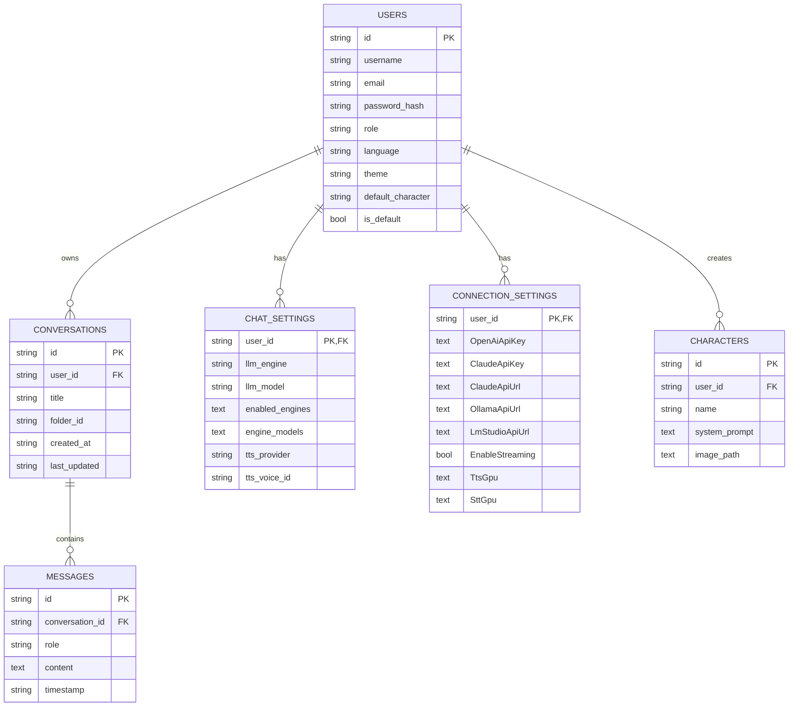
