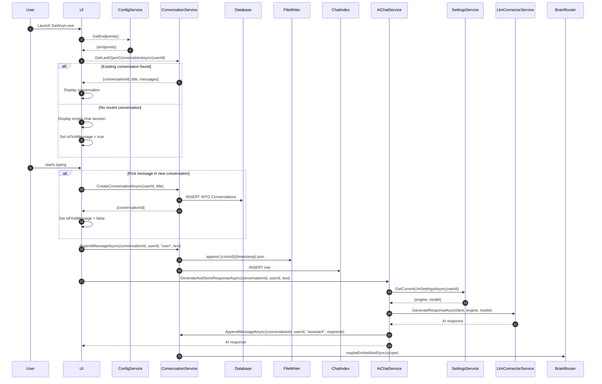
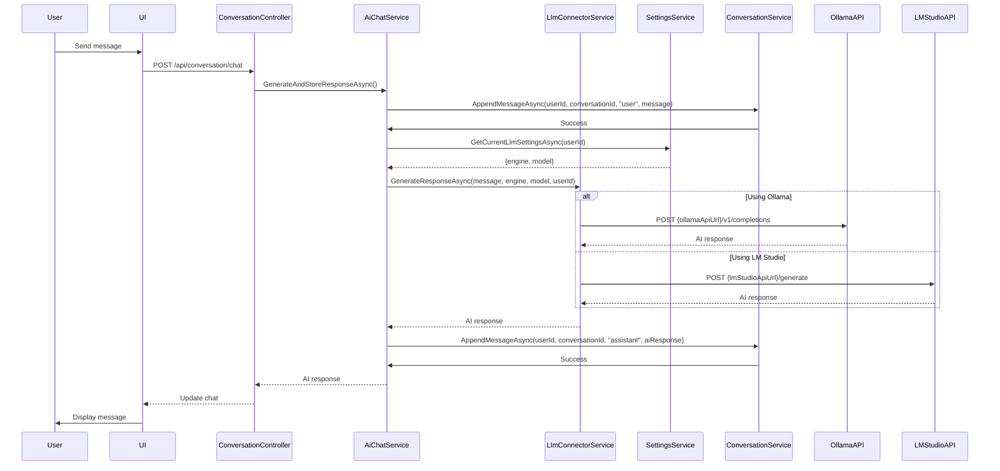
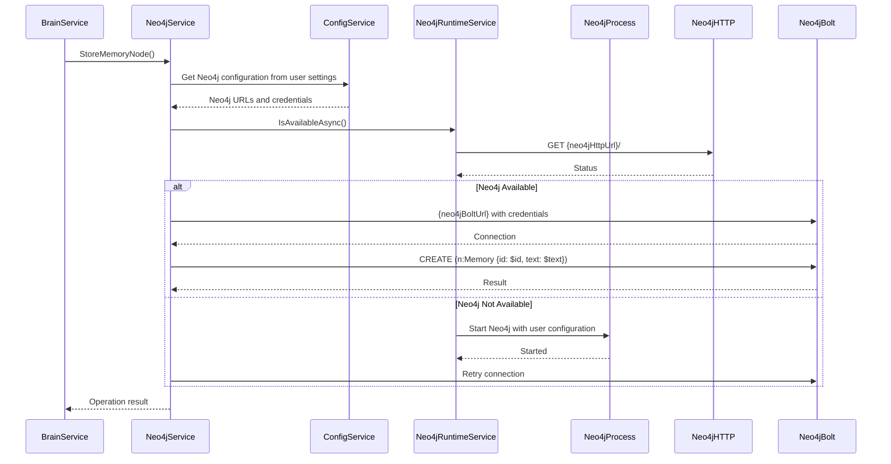

# SwAIvyn Comprehensive DataFlow Documentation

This document provides a comprehensive overview of the SwAIvyn application's data flow, including service architecture, port configurations, and the DNS-like naming system.

## Service Architecture and Port Configuration

SwAIvyn uses a DNS-like naming system for service discovery, eliminating the need for hardcoded ports. The following table shows the logical names, actual services, default ports, and their purposes:

| Logical Name | Service | Default URL | Port | Purpose | User Configurable |
|--------------|---------|-------------|------|---------|-------------------|
| api | Backend API | http://localhost:5000 | 5000 | Main SwAIvyn backend API | No |
| ollamaApi | Ollama API | http://localhost:11434 | 11434 | Local LLM service (Ollama) | **Yes** |
| lmStudioApi | LM Studio API | http://localhost:1234 | 1234 | Local LLM service (LM Studio) | **Yes** |
| chatHub | SignalR Chat Hub | /hubs/chat | 5000 | Real-time chat communication | No |
| voiceHub | SignalR Voice Hub | /hubs/voice | 5000 | Real-time voice communication | No |
| notificationHub | SignalR Notification Hub | /hubs/notification | 5000 | Real-time notifications | No |
| neo4jHttp | Neo4j HTTP API | http://localhost:7474 | 7474 | Neo4j graph database HTTP interface | **Yes** |
| neo4jBolt | Neo4j Bolt Protocol | bolt://localhost:7687 | 7687 | Neo4j graph database Bolt protocol | **Yes** |

> **Note**: The LM Studio API was originally configured to use port 5000, but has been updated to use port 1234 to avoid conflicts with the SwAIvyn backend API.

### User-Configurable Services

Several services in SwAIvyn are user-configurable through the Settings interface:

1. **LLM Services (Ollama, LM Studio, etc.)**:
   - Users can configure these in the Settings page under the "Connections" tab
   - Changes are saved to the user's settings and persist between sessions
   - Default values are provided but can be overridden by the user
   - Users can select their preferred LLM engine (Ollama or LM Studio) and model
   - These settings are used for all chat interactions

2. **Neo4j Configuration**:
   - Users can configure Neo4j connection settings in the Settings page
   - This includes URL, port, and authentication credentials

## DNS-like Naming System

SwAIvyn implements a configuration-based service discovery system that:

1. Eliminates hardcoded ports and URLs
2. Provides logical names for services
3. Centralizes configuration in one place
4. Enables dynamic reconfiguration without code changes

### Configuration in appsettings.json

```json
{
  "AppSettings": {
    "BaseUrl": "http://localhost:5000",
    "OllamaApiUrl": "http://localhost:11434",
    "LmStudioApiUrl": "http://localhost:1234",
    "Neo4jUri": "http://localhost:7474",
    "Neo4jBoltPort": 7687,
    "Neo4jHttpPort": 7474
  }
}
```

### Settings Database Storage

User-configurable settings are stored in the SQLite database in the `Settings` table:

```sql
CREATE TABLE Settings (
    Id UNIQUEIDENTIFIER PRIMARY KEY,
    UserId UNIQUEIDENTIFIER NULL,
    Key TEXT NOT NULL,
    Value TEXT NOT NULL,
    LastModified DATETIME NOT NULL
);
```

This allows for:
- Global settings (UserId = NULL)
- User-specific settings (UserId = user's ID)
- Overriding default values from appsettings.json

### Backend Implementation

The `SettingsService` provides methods to get and set settings:

```csharp
public class SettingsService : ISettingsService
{
    private readonly ApplicationDbContext _dbContext;
    private readonly IConfiguration _configuration;

    // Get a setting value, falling back to configuration if not found
    public async Task<string> GetSettingAsync(Guid? userId, string key, string defaultValue = null)
    {
        var setting = await _dbContext.Settings
            .Where(s => s.UserId == userId && s.Key == key)
            .FirstOrDefaultAsync();

        if (setting != null)
        {
            return setting.Value;
        }

        // If user-specific setting not found, try to get from configuration
        var configValue = _configuration[$"AppSettings:{key}"];
        return configValue ?? defaultValue;
    }

    // Set a setting value
    public async Task<bool> SetSettingAsync(Guid? userId, string key, string value)
    {
        var setting = await _dbContext.Settings
            .Where(s => s.UserId == userId && s.Key == key)
            .FirstOrDefaultAsync();

        if (setting == null)
        {
            setting = new Settings
            {
                Id = Guid.NewGuid(),
                UserId = userId ?? Guid.Empty,
                Key = key,
                Value = value,
                LastModified = DateTime.UtcNow
            };
            _dbContext.Settings.Add(setting);
        }
        else
        {
            setting.Value = value;
            setting.LastModified = DateTime.UtcNow;
        }

        await _dbContext.SaveChangesAsync();
        return true;
    }

    // Helper methods for common settings
    public async Task<string> GetOllamaApiUrlAsync(Guid? userId)
    {
        return await GetSettingAsync(userId, "OllamaApiUrl", "http://localhost:11434");
    }

    public async Task<string> GetLmStudioApiUrlAsync(Guid? userId)
    {
        return await GetSettingAsync(userId, "LmStudioApiUrl", "http://localhost:1234");
    }
}
```

The `ConfigurationService` uses the `SettingsService` to get endpoint information:

```csharp
public class ConfigurationService : IConfigurationService
{
    private readonly IConfiguration _configuration;
    private readonly ISettingsService _settingsService;
    private readonly string _baseUrl;

    public ConfigurationService(
        IConfiguration configuration,
        ISettingsService settingsService)
    {
        _configuration = configuration;
        _settingsService = settingsService;
        _baseUrl = _configuration["AppSettings:BaseUrl"] ?? "http://localhost:5000";
    }

    public string GetApiBaseUrl()
    {
        return _baseUrl;
    }

    public string GetSignalRHubUrl(string hubName)
    {
        return $"{_baseUrl}/hubs/{hubName}";
    }

    public async Task<Dictionary<string, string>> GetAllEndpointsAsync(Guid? userId = null)
    {
        var endpoints = new Dictionary<string, string>
        {
            { "api", GetApiBaseUrl() },
            { "chatHub", GetSignalRHubUrl("chat") },
            { "voiceHub", GetSignalRHubUrl("voice") },
            { "notificationHub", GetSignalRHubUrl("notification") }
        };

        // Add user-configurable endpoints
        endpoints["ollamaApi"] = await _settingsService.GetOllamaApiUrlAsync(userId);
        endpoints["lmStudioApi"] = await _settingsService.GetLmStudioApiUrlAsync(userId);
        endpoints["neo4jHttp"] = await _settingsService.GetNeo4jUriAsync(userId);
        endpoints["neo4jBolt"] = $"bolt://localhost:{await _settingsService.GetNeo4jBoltPortAsync(userId)}";

        return endpoints;
    }
}
```

## Core Data Flow Diagrams

### Startup Flow



### LLM Interaction Flow



### Neo4j Interaction Flow



## Database Persistence Strategy

SwAIvyn uses a multi-layered data persistence strategy:

1. **SQLite Database (WAL mode)**
   - Primary storage for all structured data
   - Stores users, folders, conversations, chat indices, and settings
   - Uses WAL mode for better performance and concurrency
   - Connection string: `Data Source=../data/swai-vyn.db`

2. **SQLite-VSS Extension**
   - Stores vector embeddings for semantic search
   - Enables efficient similarity search using HNSW algorithm
   - Integrated with the main SQLite database
   - Extension path: `sqlite-vss.dll`

3. **Neo4j Graph Database**
   - Stores memory nodes and relationships
   - Enables complex graph queries and visualizations
   - Can be embedded or remote
   - HTTP URL: `http://localhost:7474`
   - Bolt URL: `bolt://localhost:7687`
   - Default credentials: Username `neo4j`, Password `password`

4. **File System**
   - Stores chat messages as JSON files
   - Organized by conversation ID and timestamp
   - Stores binary assets like avatar images
   - Referenced by file paths stored in the database
   - Base directory: `../data`

## Troubleshooting Port Conflicts

If you encounter port conflicts:

1. **Backend API (port 5000)**:
   - Check if another application is using port 5000
   - Update `AppSettings:BaseUrl` in appsettings.json
   - Common conflicts: IIS Express, other web servers

2. **LM Studio API (port 1234)**:
   - Ensure LM Studio is configured to use port 1234
   - Update `AppSettings:LmStudioApiUrl` if LM Studio uses a different port

3. **Neo4j (ports 7474 and 7687)**:
   - Check if another Neo4j instance is running
   - Update `AppSettings:Neo4jHttpPort` and `AppSettings:Neo4jBoltPort`

4. **Ollama API (port 11434)**:
   - Verify Ollama is running on the default port
   - Update `AppSettings:OllamaApiUrl` if needed

## Changing Service Configurations

There are two ways to change service configurations in SwAIvyn:

### 1. Through the Settings UI (Recommended)

Users can change service configurations directly through the SwAIvyn Settings interface:

1. Open SwAIvyn application
2. Click on the Settings icon
3. Navigate to the "Connections" tab
   - Update service URLs and ports as needed
4. Navigate to the "LLM" tab
   - Select preferred LLM engine (Ollama or LM Studio)
   - Select preferred model (for Ollama)
5. Save changes

This method is preferred as it:
- Doesn't require application restart
- Doesn't require editing configuration files
- Changes persist between sessions
- Provides a user-friendly interface
- Settings are applied immediately to all chat interactions

### 2. Through Configuration Files (Advanced)

For advanced users or system administrators, service configurations can also be changed by:

1. Edit `appsettings.json`
2. Update the relevant URL or port
3. Restart the application

Example for changing LM Studio port:
```json
"AppSettings": {
  "LmStudioApiUrl": "http://localhost:8080"
}
```

This method sets the default values that will be used if no user-specific settings are found.

This comprehensive documentation provides a complete overview of SwAIvyn's data flow, service architecture, port configurations, and the DNS-like naming system.
