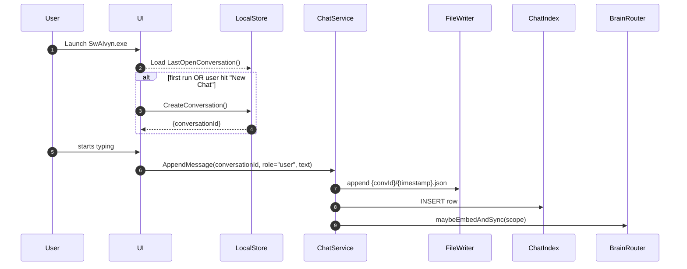
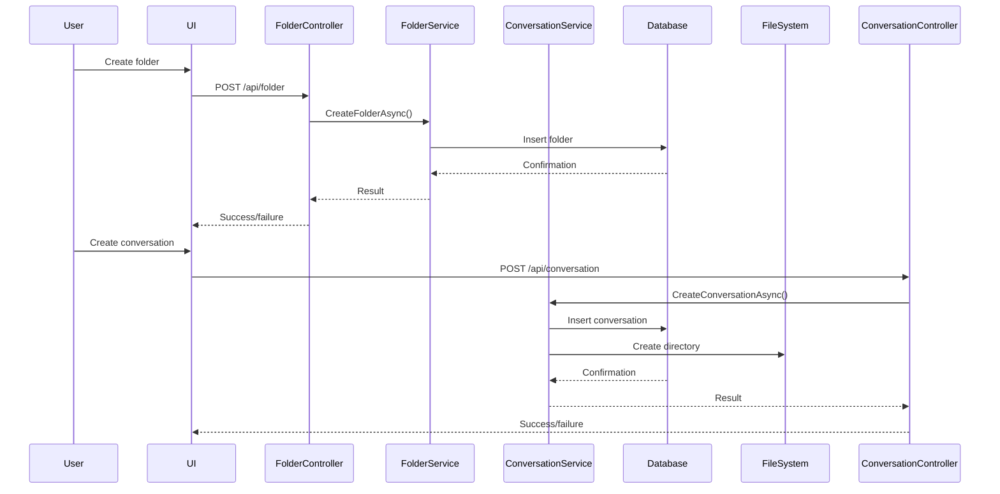
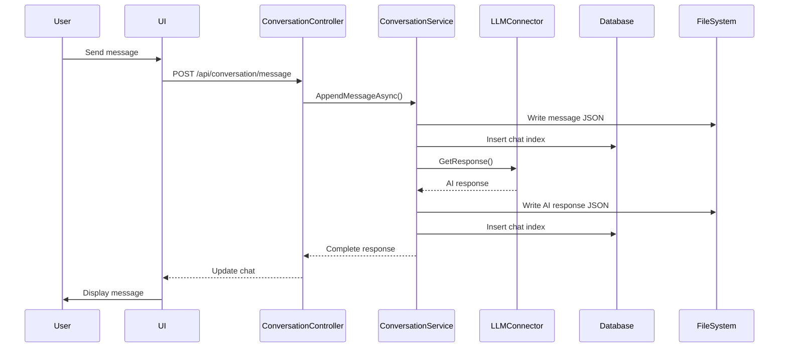
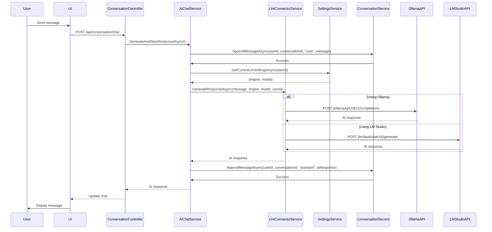
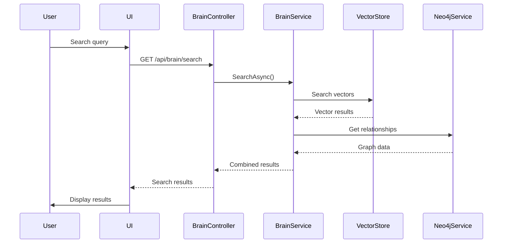
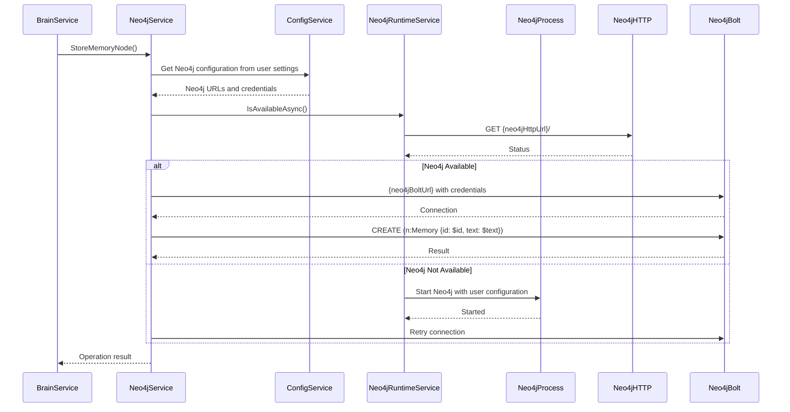

# SwAIvyn Updated Data Flow

## Overview

This document outlines the updated data flow within the SwAIvyn application, showing how information moves between components and is stored in the database.

## Core Data Entities

1. **Users**
   - Represents application users
   - Contains authentication information
   - Links to conversations, folders, memories, and settings

2. **Folders**
   - Organizes conversations in a hierarchical structure
   - Can have parent-child relationships
   - Contains metadata about the folder

3. **Conversations**
   - Represents chat sessions
   - Contains metadata about the conversation
   - Belongs to a folder (optional)
   - Links to chat index entries

4. **Chat Index**
   - References to chat message files
   - Contains metadata about messages (role, creation time)
   - Enables efficient search and retrieval

5. **Memories**
   - User-specific information stored for later recall
   - Contains content, category, and access timestamps
   - Used for personalization and context

6. **Vector Embeddings**
   - Semantic representations of text
   - Enables similarity search
   - Stored in SQLite-VSS tables

7. **Graph Relationships**
   - Connections between memories and concepts
   - Stored in Neo4j graph database
   - Enables relationship visualization

8. **Settings**
   - Application and user preferences
   - Can be global or user-specific
   - Controls application behavior

## Data Flow Diagrams

### Startup Flow



### Folder and Conversation Management Flow



### Chat Interaction Flow



### LLM Interaction Flow



### Brain Search Flow



### Neo4j Interaction Flow



## Database Interactions

### Reading Data

1. **Fetching Folders**
   ```csharp
   var folders = await _dbContext.Folders
       .Where(f => f.UserId == userId)
       .OrderBy(f => f.Name)
       .ToListAsync();
   ```

2. **Retrieving Conversations**
   ```csharp
   var conversations = await _dbContext.Conversations
       .Where(c => c.UserId == userId)
       .OrderByDescending(c => c.LastOpenUtc)
       .ToListAsync();
   ```

3. **Getting Last Open Conversation**
   ```csharp
   var conversation = await _dbContext.Conversations
       .Where(c => c.UserId == userId)
       .OrderByDescending(c => c.LastOpenUtc)
       .FirstOrDefaultAsync();
   ```

4. **Searching Brain**
   ```csharp
   // Generate embedding for the query
   var queryEmbedding = await _embeddingService.EmbedTextAsync(query);
   
   // Search the vector store
   var hits = await _vectorStore.SearchAsync(queryEmbedding, limit, scope);
   ```

### Writing Data

1. **Creating a Folder**
   ```csharp
   var folder = new Folder
   {
       Id = Guid.NewGuid(),
       UserId = userId,
       Name = name,
       ParentId = parentId,
       CreatedUtc = DateTime.UtcNow
   };
   _dbContext.Folders.Add(folder);
   await _dbContext.SaveChangesAsync();
   ```

2. **Creating a Conversation**
   ```csharp
   var conversation = new Conversation
   {
       Id = Guid.NewGuid(),
       UserId = userId,
       FolderId = folderId,
       Title = title,
       CreatedUtc = DateTime.UtcNow,
       LastOpenUtc = DateTime.UtcNow
   };
   _dbContext.Conversations.Add(conversation);
   await _dbContext.SaveChangesAsync();
   
   // Create the conversation directory
   var conversationDir = Path.Combine(_sessionsDirectory, conversation.Id.ToString());
   Directory.CreateDirectory(conversationDir);
   ```

3. **Appending a Message**
   ```csharp
   // Create a timestamp for the file
   var timestamp = DateTime.UtcNow;
   var fileName = $"{timestamp:yyyyMMdd_HHmmss}.json";
   var filePath = Path.Combine(conversationDir, fileName);

   // Create the message object
   var message = new { role, content, timestamp = timestamp.ToString("o") };

   // Write the message to the file
   await File.WriteAllTextAsync(filePath, JsonSerializer.Serialize(message));

   // Create a chat index entry
   var chatIndex = new ChatIndex
   {
       Id = Guid.NewGuid(),
       ConversationId = conversationId,
       Role = role,
       FilePath = Path.Combine("sessions", conversationId.ToString(), fileName),
       CreatedUtc = timestamp
   };
   _dbContext.ChatIndices.Add(chatIndex);
   await _dbContext.SaveChangesAsync();
   ```

4. **Adding a Memory to Brain**
   ```csharp
   // Generate embedding for the text
   var embedding = await _embeddingService.EmbedTextAsync(text);

   // Store the embedding in the vector store
   var vectorStoreSuccess = await _vectorStore.StoreVectorAsync(id, embedding, metadata);

   // Create a node in Neo4j
   var properties = new Dictionary<string, object>
   {
       { "id", id.ToString() },
       { "text", text }
   };
   var node = await _neo4jService.CreateNodeAsync(new List<string> { "Memory" }, properties);
   ```

## Data Persistence Strategy

1. **SQLite Database (WAL mode)**
   - Primary storage for all structured data
   - Stores users, folders, conversations, chat indices, and settings
   - Uses WAL mode for better performance and concurrency

2. **SQLite-VSS Extension**
   - Stores vector embeddings for semantic search
   - Enables efficient similarity search using HNSW algorithm
   - Integrated with the main SQLite database

3. **Neo4j Graph Database**
   - Stores memory nodes and relationships
   - Enables complex graph queries and visualizations
   - Can be embedded or remote

4. **File System**
   - Stores chat messages as JSON files
   - Organized by conversation ID and timestamp
   - Stores binary assets like avatar images
   - Referenced by file paths stored in the database

5. **In-Memory Cache**
   - Caches frequently accessed data
   - Reduces database load
   - Improves application responsiveness
