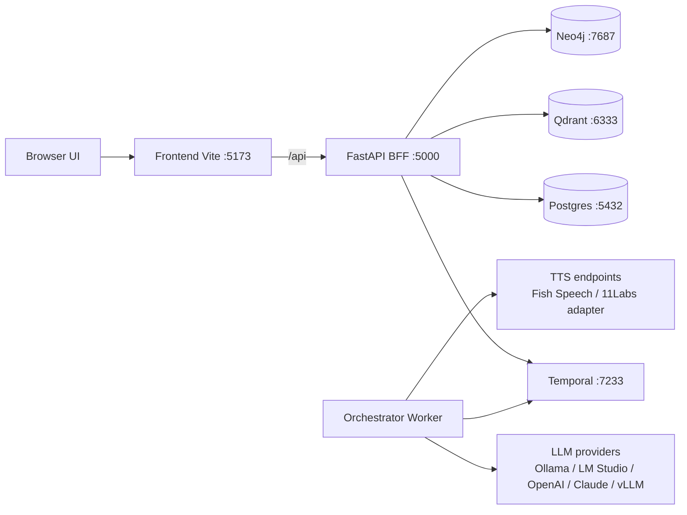
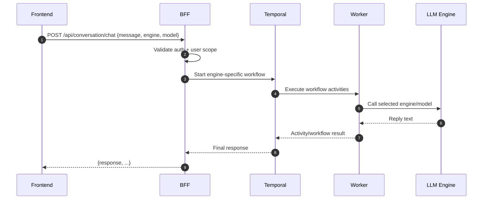
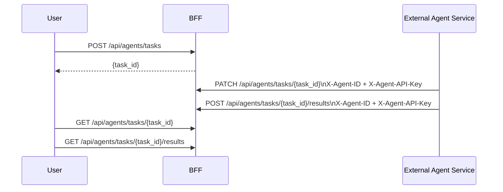

# Architecture and Dataflow

This document reflects the current app structure and routing behavior.

## Runtime topology

## Chat request dataflow

### Routing guarantees

- Requests are scoped to authenticated users.
- Selected `engine`/`model` drive workflow selection.
- Admin users can access cross-user resources where explicitly allowed.

## External agent dataflow

## Health/readiness

- BFF exposes:
  - `/healthz`
  - `/readyz`
  - `/api/healthz`
  - `/api/readyz`
- Worker health server listens on `ORCHESTRATOR_HEALTH_PORT` (default `8088`) with `/healthz` and `/readyz`.
