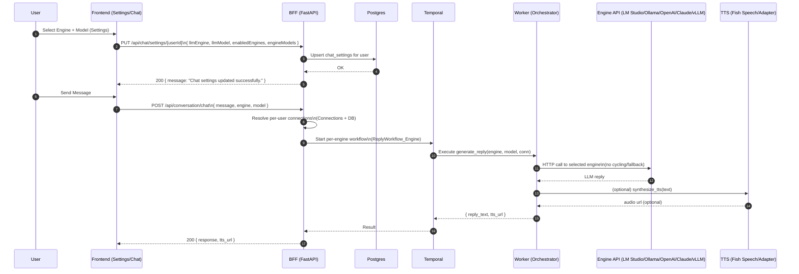
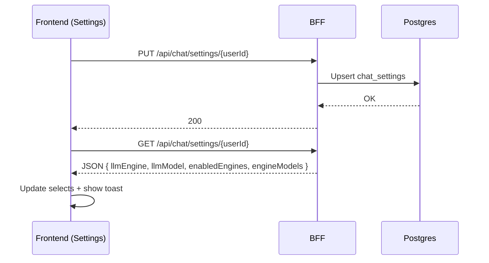
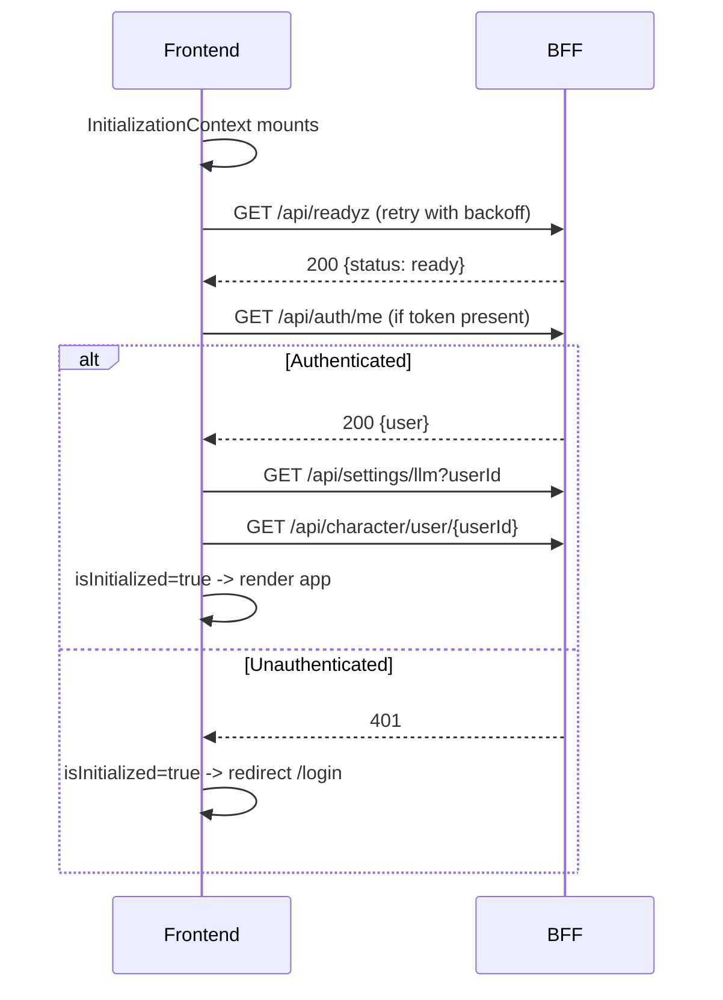
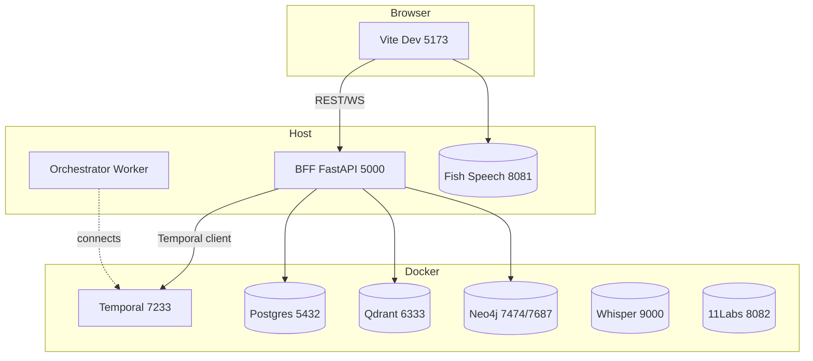
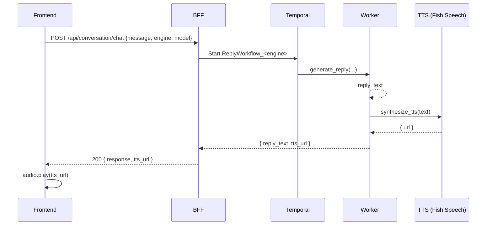
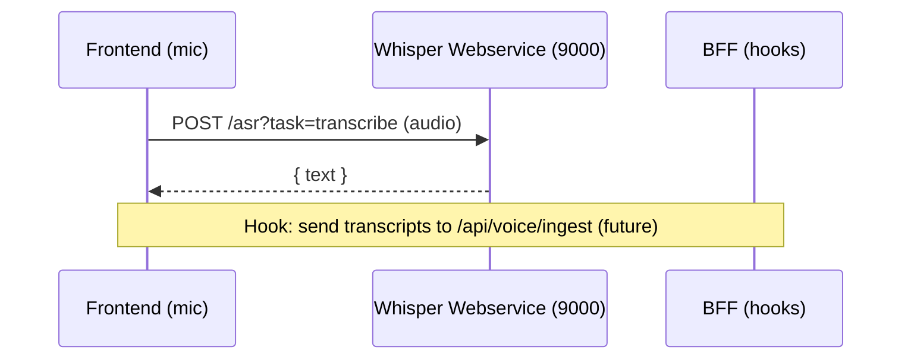
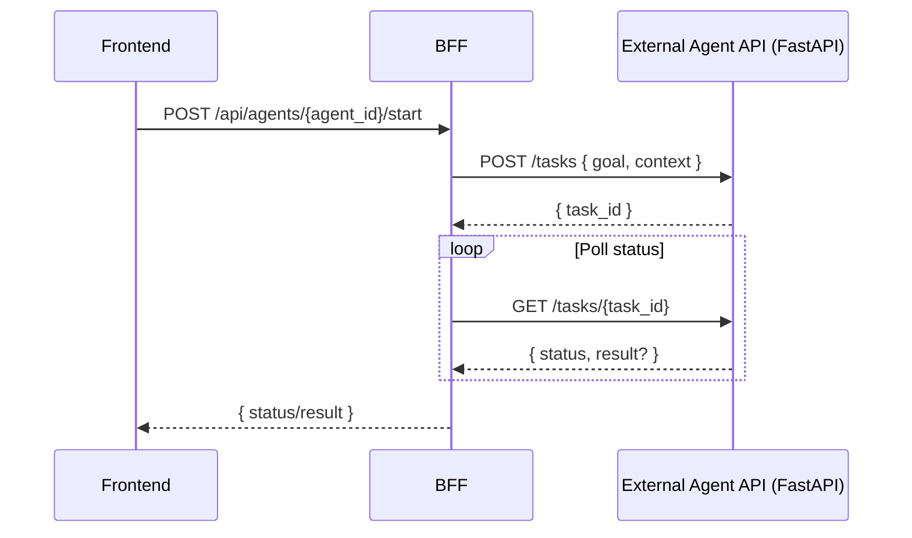

# Dataflow & Architecture Diagrams

This document captures the hybrid dev topology and the per-user request flows. Diagrams use Mermaid and render on GitHub and most Markdown viewers.

## Hybrid Dev Topology

```mermaid
flowchart LR
  subgraph Host
    FE[Frontend (Vite 5173)] -->|REST/WS| BFF[BFF (FastAPI 5000)]
    BFF -->|Temporal Client| TMP[Temporal Frontend (7233)]
    WKR[Orchestrator Worker] -.runs via dev-orchestrator.ps1.- TMP
    BFF -->|JDBC/asyncpg| PG[(Postgres)]
    BFF -->|HTTP| QD[(Qdrant)]
    BFF -->|Bolt| NEO[(Neo4j)]
    FE -->|HTTP| TTS[(Fish Speech TTS 8081)]
  end

  subgraph Docker (infra)
    PG
    QD
    NEO
    STT[Whisper STT 9000]
    TMP
    ADPT[11Labs Adapter 8082]
  end

  WKR -->|HTTP (engine-specific)| LLM1[LM Studio /v1]
  WKR -->|HTTP| OLL[Ollama /api]
  WKR -->|HTTP| OAI[OpenAI /v1]
  WKR -->|HTTP| CLD[Claude /v1]
  WKR -->|HTTP| VLLM[vLLM /v1]

  classDef host fill:#f0fff4,stroke:#16a34a,stroke-width:1px;
  classDef docker fill:#f8fafc,stroke:#334155,stroke-width:1px;
  class Host host;
  class Docker docker;
```

Notes
- Apps run on host with hot-reload; infra runs in Docker.
- TTS can run on host (`-UseHostTTS`) or in Docker (profile `tts`).
- Compose profiles keep app-tier images optional: `orchestrator`, `tts`, `tts-adapter`.

## Per-User Chat Message Flow



Guarantees
- Strict routing: only the selected engine/model is called (no cycling).
- Per-user isolation enforced in BFF for settings, connections, and conversations; admin can access all.

## Settings Save & Rehydrate (UI)



## Environment Keys (dev highlights)
- `FISHSPEECH_URL` - set to `http://localhost:8081` for host TTS or `http://tts:8081` for container TTS
- `OLLAMA_HOST`, `LMSTUDIO_HOST` - host URLs for engines when running worker on host
- `OPENAI_API_KEY`, `CLAUDE_API_KEY` - required to enable those engines

## Profiles / Scripts
- Compose profiles: `orchestrator`, `tts`, `tts-adapter`
- Scripts:
  - `scripts/infra-up.ps1` - start only infra (with optional profiles)
  - `scripts/dev-start.ps1 -UseHostTTS` - start host apps + host TTS
  - `scripts/dev-tts.ps1` - run Fish Speech on host
  - `scripts/dev-stop.ps1` - stop host apps (and host TTS)
  - `scripts/update.ps1` - update deps/images

## Authentication (Login) Flow

```mermaid
sequenceDiagram
  autonumber
  participant U as User
  participant FE as Frontend
  participant B as BFF (FastAPI)
  participant DB as Postgres

  U->>FE: Submit username/password
  FE->>B: POST /api/auth/login {identifier, password}
  B->>DB: SELECT users WHERE username/email
  DB-->>B: Row (id, password_hash, role)
  B-->>FE: 200 {access_token, user}
  FE->>FE: Save token to localStorage (if Remember Me)
  FE->>FE: Set axios Authorization: Bearer <token>
  FE->>B: GET /api/auth/me (boot check)
  B-->>FE: Current user (id, role, prefs)
  FE->>FE: Auth gate opens; render app
```

## Initialization & Auth Gate (UI)



## Authorization Matrix (summary)

| Resource/Action                          | User (self) | Admin |
|------------------------------------------|-------------|-------|
| GET/PUT /api/chat/settings/{userId}      | [CHECK] (self)    | [CHECK] any |
| GET/POST/PUT /api/settings/connections   | [CHECK] (self)    | [CHECK] any |
| GET /api/conversation/user/{userId}      | [CHECK] (self)    | [CHECK] any |
| GET/PUT /api/conversation/{id}/(title|folder|messages) | [CHECK] owner | [CHECK] any |
| POST /api/conversation/message           | [CHECK] owner     | [CHECK] any |
| GET /api/llm/models (userId)            | [CHECK] (self)    | [CHECK] override |

## Network Boundaries & Ports



## LLM Routing (Strict, Per-Engine)

```mermaid
flowchart LR
  IN[POST /api/conversation/chat\n{engine, model, message}] --> VALIDATE{engine & model?}
  VALIDATE -- no --> ERR[400 Invalid engine/model]
  VALIDATE -- yes --> WF[Pick ReplyWorkflow_<engine>]
  WF --> ACT[generate_reply(engine, model, conn)]
  ACT --> CALL[HTTP call to selected engine]
  CALL --> OK{200?}
  OK -- no --> FAIL[Error: LLM request failed]
  OK -- yes --> RESP[reply_text]
```

## TTS Playback Pipeline



## STT Ingestion (Voice Room - current + hooks)



## Agents / Federation Hooks (future)



## Error & Retry Surfaces

- Frontend:
  - Initialization: `/api/readyz` with backoff, `fetchWithRetry`
  - Settings saves: toast on success, "Save failed" on errors
- Backend:
  - `/api/llm/models`: returns 200 with `{models: []}` on discovery failure (UI stays responsive)
  - `/api/conversation/chat`: 400 when engine/model invalid; 503 when Temporal not ready; 500 on workflow error
- Worker:
  - Strict routing; returns descriptive error text if the selected engine call fails

## Database Schema (ER)

```mermaid
erDiagram
  USERS ||--o{ CONVERSATIONS : owns
  USERS ||--o{ CHAT_SETTINGS : has
  USERS ||--o{ CONNECTION_SETTINGS : has
  USERS ||--o{ CHARACTERS : creates
  CONVERSATIONS ||--o{ MESSAGES : contains

  USERS {
    string id PK
    string username
    string email
    string password_hash
    string role
    string language
    string theme
    string default_character
    bool   is_default
  }
  CHAT_SETTINGS {
    string user_id PK,FK
    string llm_engine
    string llm_model
    text   enabled_engines  // JSON
    text   engine_models    // JSON
    string tts_provider
    string tts_voice_id
  }
  CONNECTION_SETTINGS {
    string user_id PK,FK
    text   OpenAiApiKey
    text   ClaudeApiKey
    text   ClaudeApiUrl
    text   OllamaApiUrl
    text   LmStudioApiUrl
    bool   EnableStreaming
    text   TtsGpu
    text   SttGpu
  }
  CHARACTERS {
    string id PK
    string user_id FK  // nullable (shared)
    string name
    text   system_prompt
    text   image_path
  }
  CONVERSATIONS {
    string id PK
    string user_id FK
    string title
    string folder_id
    string created_at
    string last_updated
  }
  MESSAGES {
    string id PK
    string conversation_id FK
    string role
    text   content
    string timestamp
  }
```
