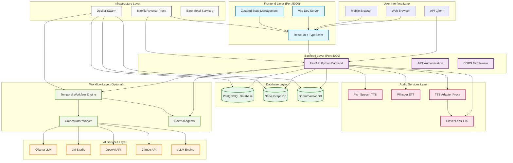
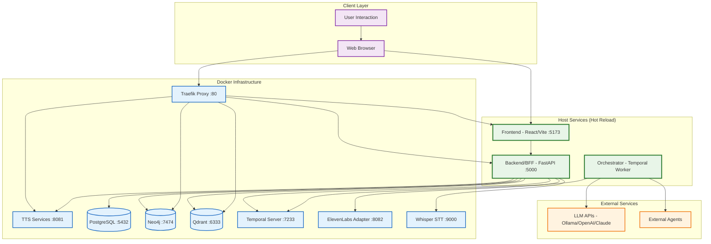
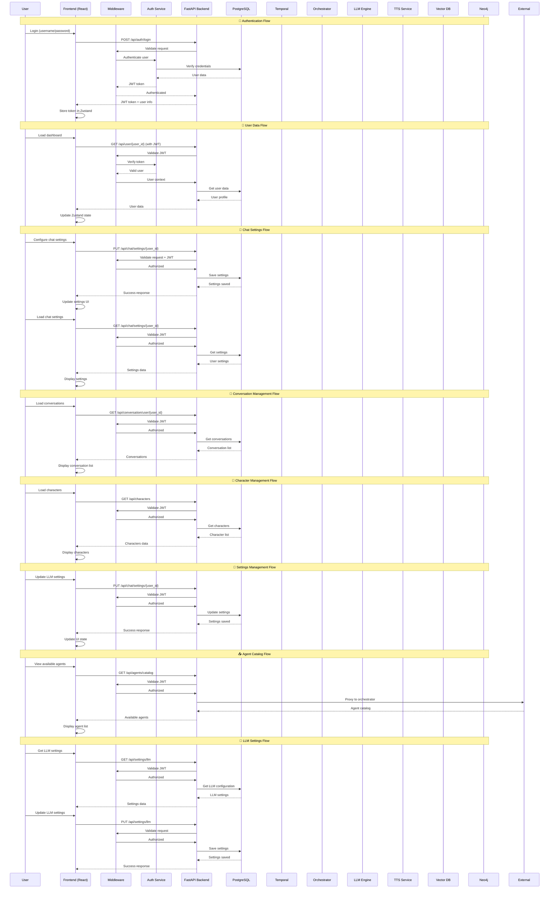
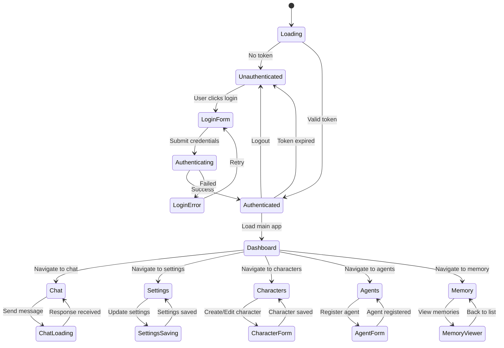
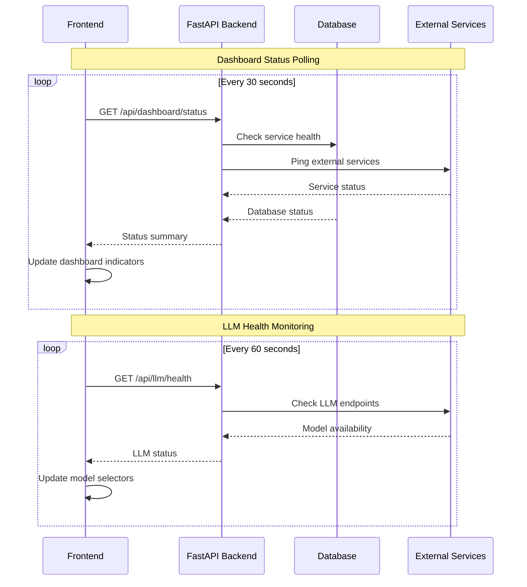
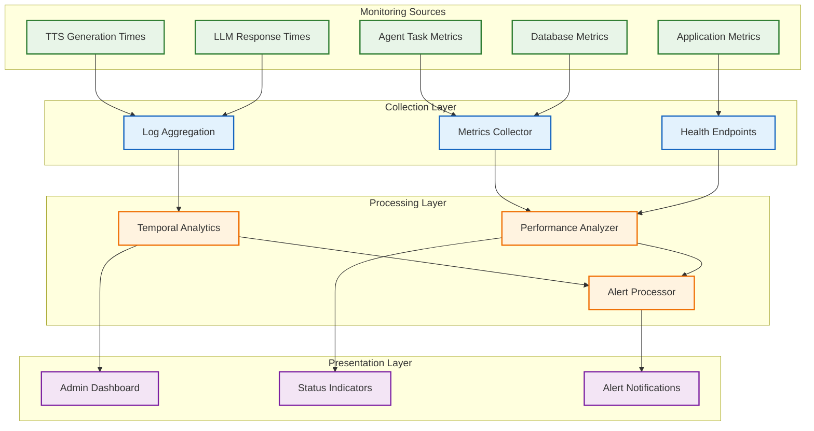

# SwAIvyn Comprehensive Network Diagrams

This document provides comprehensive dataflow and API call flow diagrams for the SwAIvyn system, covering all deployment scenarios and detailed API interactions.

## 🌐 Complete System Architecture Overview



## 🔄 Hybrid Development Architecture



## 📊 Complete API Call Flow Diagram



## 🖥️ Deployment Architecture Comparison

```mermaid
graph TB
    subgraph "Hybrid Development (Local)"
        HD_USER[User] --> HD_FE[Frontend Host :5173]
        HD_USER --> HD_TRAEFIK[Traefik Docker :80]
        HD_FE --> HD_BE[Backend Host :5000]
        HD_TRAEFIK --> HD_FE
        HD_TRAEFIK --> HD_BE
        HD_BE --> HD_PG[(PostgreSQL Docker :5432)]
        HD_BE --> HD_NEO[(Neo4j Docker :7474)]
        HD_BE --> HD_QD[(Qdrant Docker :6333)]
        HD_BE --> HD_TEMP[Temporal Docker :7233]
        HD_BE --> HD_TTS[TTS Docker :8081]
        HD_TEMP --> HD_ORCH[Orchestrator Host]
        HD_ORCH --> HD_LLM[External LLM Services]
        Note over HD_USER,HD_LLM: Apps on host for hot reload, infrastructure in Docker
    end
    
    subgraph "Bare Metal Windows Deployment"
        BM_USER[User] --> BM_FE[Frontend Native :5000]
        BM_USER --> BM_BE[Backend Native :8000]
        BM_FE --> BM_BE
        BM_BE --> BM_PG[(PostgreSQL Native :5432)]
        BM_BE --> BM_NEO[(Neo4j Native :7474)]
        BM_BE --> BM_QD[(Qdrant Native :6333)]
        BM_BE --> BM_TEMP[Temporal Native :7233]
        BM_BE --> BM_TTS[Fish TTS Native :8081]
        BM_TEMP --> BM_ORCH[Orchestrator Native]
        BM_ORCH --> BM_LLM[LLM Services]
        Note over BM_USER,BM_LLM: All services run natively without containers
    end
    
    subgraph "Cloud Development (Replit)"
        CD_USER[User] --> CD_FE[Frontend :5000]
        CD_FE --> CD_BE[Backend :8000]
        CD_BE --> CD_PG[(Managed PostgreSQL)]
        CD_BE --> CD_LLM[External LLM APIs]
        Note over CD_USER,CD_LLM: Simplified deployment - core services only
    end
    
    %% Styling
    classDef baremetal fill:#e8f5e8,stroke:#2e7d32,stroke-width:2px
    classDef docker fill:#e3f2fd,stroke:#1565c0,stroke-width:2px
    classDef cloud fill:#fff3e0,stroke:#ef6c00,stroke-width:2px
    
    class BM_USER,BM_FE,BM_BE,BM_PG,BM_NEO,BM_QD,BM_TEMP,BM_TTS,BM_ORCH,BM_LLM baremetal
    class DS_USER,DS_TRAEFIK,DS_FE,DS_BE,DS_PG,DS_NEO,DS_QD,DS_TEMP,DS_TTS,DS_ORCH,DS_LLM docker
    class CD_USER,CD_FE,CD_BE,CD_PG,CD_LLM cloud
```

## 📱 Frontend Authentication & State Flow



## 🔄 Status Polling Flow



## 📊 Performance Monitoring Flow



---

## 📋 Summary

These comprehensive diagrams provide a complete view of SwAIvyn's hybrid architecture including:

1. **Hybrid Development Architecture** - Host services (hot reload) + Docker infrastructure
2. **Complete API Call Flow** - REST endpoint patterns based on actual FastAPI routes
3. **Deployment Architecture Comparison** - Local hybrid vs bare metal vs cloud deployment
4. **Frontend Authentication State Flow** - Client-side authentication and navigation
5. **Status Polling Flow** - Real-time dashboard updates via polling
6. **Performance Monitoring** - System health and metrics collection

## 🚧 Known Architecture Notes

- **SignalR Frontend Code**: The frontend contains `useChatHub.ts` with SignalR client code, but no corresponding SignalR hubs exist in the FastAPI backend. This appears to be leftover from earlier architecture or planned future feature.
- **Current Communication**: All real-time updates use REST API polling rather than WebSocket/SignalR connections.
- **Port Mapping**: Local development uses Frontend :5173 + Backend :5000; Replit/cloud uses Frontend :5000 + Backend :8000.

These diagrams serve as a reference for:
- **Developers** understanding the actual hybrid system architecture
- **DevOps** planning deployments and scaling strategies
- **Troubleshooting** system issues and performance bottlenecks
- **Integration** planning for external agents and services