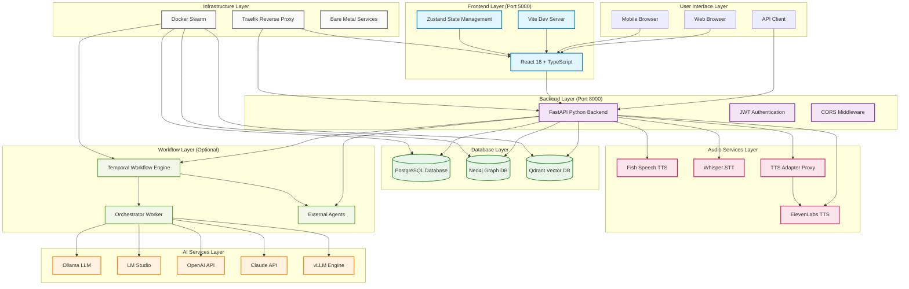
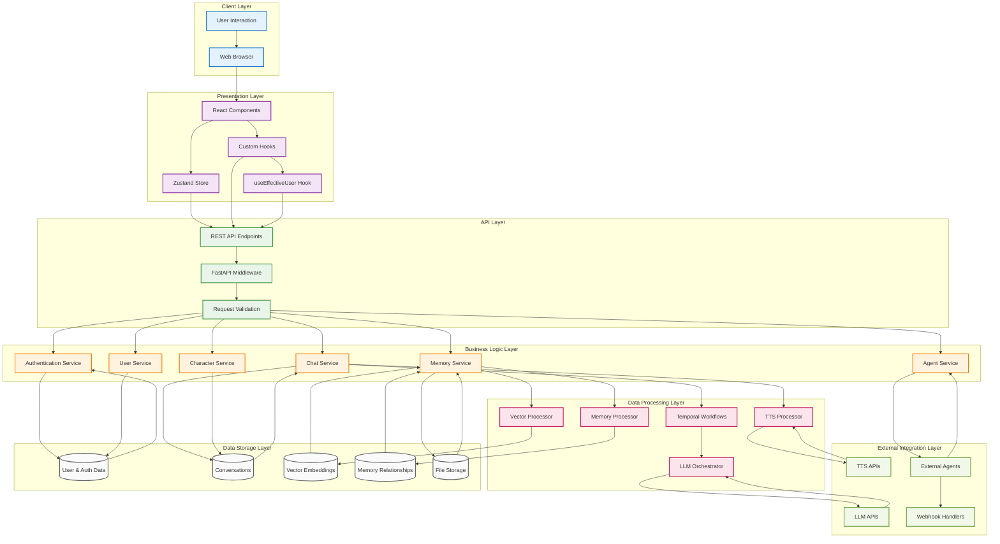
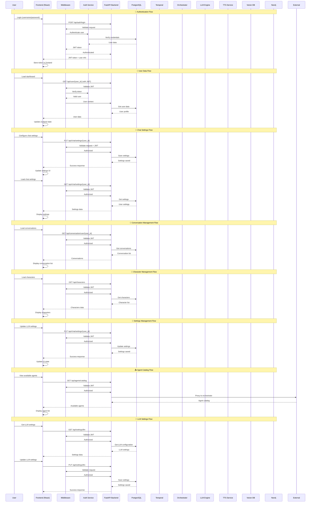
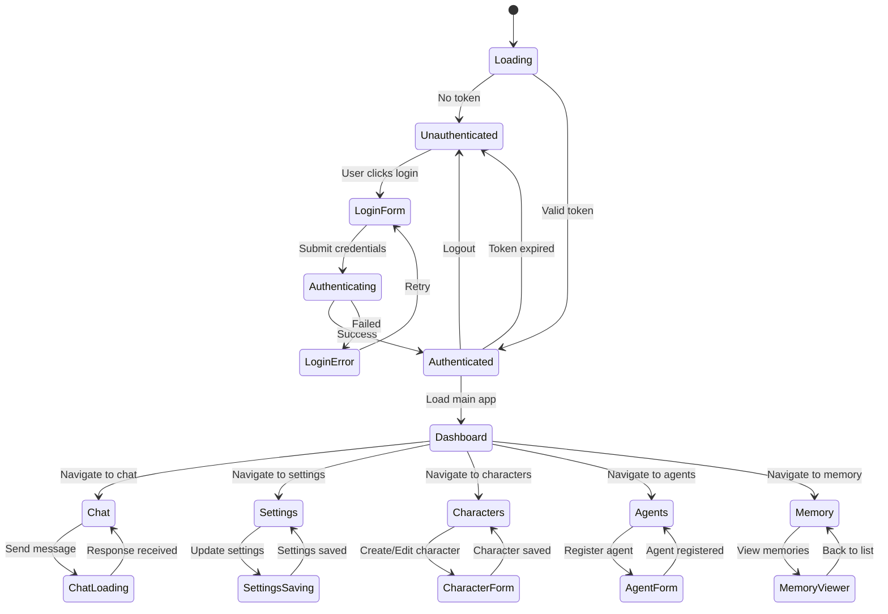
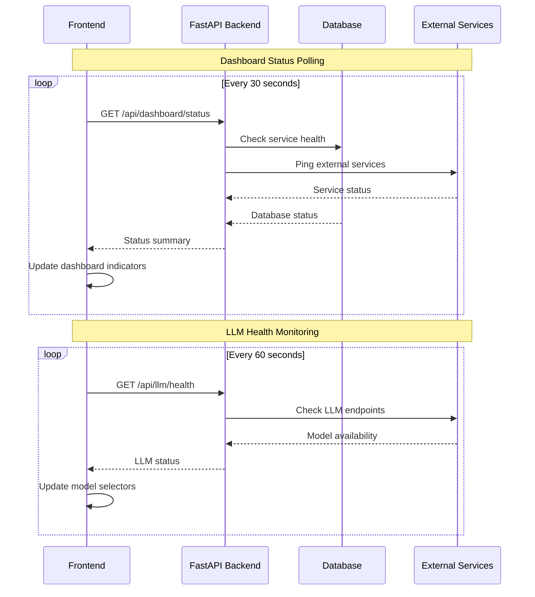
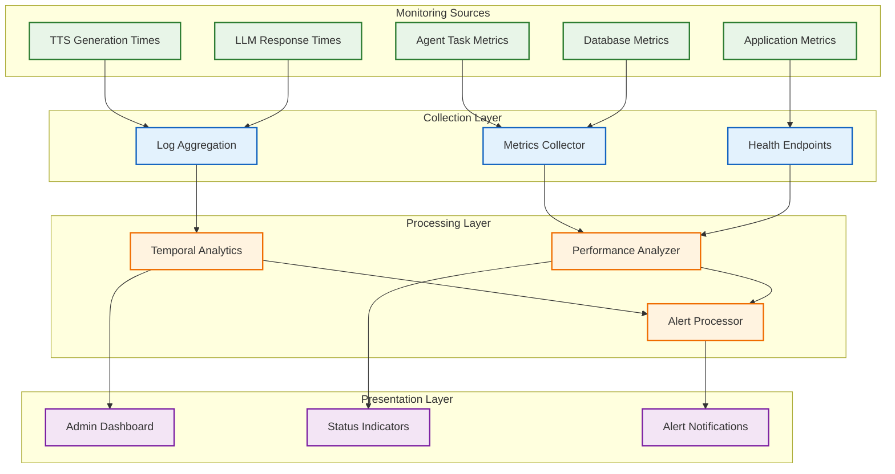

# SwAIvyn Comprehensive Network Diagrams

This document provides comprehensive dataflow and API call flow diagrams for the SwAIvyn system, covering all deployment scenarios and detailed API interactions.

## 🌐 Complete System Architecture Overview



## 🔄 Complete Data Flow Architecture



## 📊 Complete API Call Flow Diagram



## 🖥️ Deployment Architecture Comparison

```mermaid
graph TB
    subgraph "Bare Metal Windows Deployment"
        BM_USER[User] --> BM_FE[Frontend :5000]
        BM_USER --> BM_BE[Backend :8000]
        BM_FE --> BM_BE
        BM_BE --> BM_PG[(PostgreSQL :5432)]
        BM_BE --> BM_NEO[(Neo4j :7474)]
        BM_BE --> BM_QD[(Qdrant :6333)]
        BM_BE --> BM_TEMP[Temporal :7233]
        BM_BE --> BM_TTS[Fish TTS :8081]
        BM_TEMP --> BM_ORCH[Orchestrator]
        BM_ORCH --> BM_LLM[LLM Services]
    end
    
    subgraph "Docker Swarm Deployment"
        DS_USER[User] --> DS_TRAEFIK[Traefik :80]
        DS_TRAEFIK --> DS_FE[Frontend Container]
        DS_TRAEFIK --> DS_BE[Backend Container]
        DS_BE --> DS_PG[(PostgreSQL Container)]
        DS_BE --> DS_NEO[(Neo4j Container)]
        DS_BE --> DS_QD[(Qdrant Container)]
        DS_BE --> DS_TEMP[Temporal Container]
        DS_BE --> DS_TTS[TTS Container]
        DS_TEMP --> DS_ORCH[Orchestrator Container]
        DS_ORCH --> DS_LLM[External LLM Services]
    end
    
    subgraph "Cloud Development (Replit)"
        CD_USER[User] --> CD_FE[Frontend :5000]
        CD_FE --> CD_BE[Backend :8000]
        CD_BE --> CD_PG[(Managed PostgreSQL)]
        CD_BE --> CD_LLM[External LLM APIs]
        
    Note over CD_USER,CD_LLM: Simplified cloud deployment with core services only
    end
    
    %% Styling
    classDef baremetal fill:#e8f5e8,stroke:#2e7d32,stroke-width:2px
    classDef docker fill:#e3f2fd,stroke:#1565c0,stroke-width:2px
    classDef cloud fill:#fff3e0,stroke:#ef6c00,stroke-width:2px
    
    class BM_USER,BM_FE,BM_BE,BM_PG,BM_NEO,BM_QD,BM_TEMP,BM_TTS,BM_ORCH,BM_LLM baremetal
    class DS_USER,DS_TRAEFIK,DS_FE,DS_BE,DS_PG,DS_NEO,DS_QD,DS_TEMP,DS_TTS,DS_ORCH,DS_LLM docker
    class CD_USER,CD_FE,CD_BE,CD_PG,CD_LLM cloud
```

## 📱 Frontend Authentication & State Flow



## 🔄 Status Polling Flow



## 📊 Performance Monitoring Flow



---

## 📋 Summary

These comprehensive diagrams provide a complete view of SwAIvyn's architecture including:

1. **System Architecture Overview** - High-level component relationships
2. **Complete Data Flow** - End-to-end data processing flow
3. **API Call Flow** - Detailed request/response patterns for all major operations
4. **Deployment Comparison** - Architecture differences across deployment types
5. **Frontend State Flow** - Client-side authentication and navigation flow
6. **Real-time Communication** - WebSocket and streaming interactions
7. **Performance Monitoring** - System health and metrics collection

These diagrams serve as a reference for:
- **Developers** understanding the system architecture
- **DevOps** planning deployments and scaling
- **Troubleshooting** system issues and performance bottlenecks
- **Integration** planning for external agents and services
- **Documentation** for comprehensive system understanding